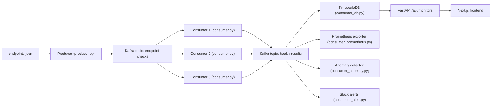

# SignalOps

SignalOps is a distributed health-check pipeline for backend endpoints. A producer publishes endpoint tasks to Kafka, multiple consumers perform checks in parallel, and downstream processors store results in TimescaleDB, expose Prometheus metrics, and trigger Slack alerts.

## Architecture



Flow summary:
- Producer reads `endpoints.json` and publishes tasks to `endpoint-checks`.
- Three consumers share `group_id=health-check-workers` and process partitions in parallel.
- Results are published to `health-results`.
- Result processors write to TimescaleDB, expose Prometheus metrics, and trigger Slack alerts.
- FastAPI serves `/api/monitors`, and the Next.js UI displays it.

## Quick Start
1. Configure `endpoints.json`.
2. Set secrets in `.env`.
3. Start the stack:
   ```bash
   docker compose up --build -d
   ```
4. Run migration (first run only):
   ```bash
   docker compose run --rm consumer-db python migrate.py
   ```
5. Verify:
   ```bash
   curl http://localhost:8000/api/monitors
   curl http://localhost:8001/metrics | grep signalops
   ```

## Configure Endpoints
`endpoints.json` supports methods, payloads, expected status, and optional auth.

Example:
```json
[
  {
    "id": "ep1",
    "url": "https://jsonplaceholder.typicode.com/posts",
    "method": "GET",
    "expected_status": 200
  },
  {
    "id": "ep2",
    "url": "https://api.example.com/users",
    "method": "POST",
    "payload": {"name": "test", "email": "test@test.com"},
    "expected_status": 201,
    "auth": {
      "type": "bearer",
      "token": "${API_TOKEN}"
    }
  },
  {
    "id": "ep3",
    "url": "https://api.example.com/data",
    "method": "GET",
    "expected_status": 200,
    "auth": {
      "type": "api_key",
      "header": "X-API-Key",
      "token": "${API_KEY}"
    }
  }
]
```

Notes:
- `expected_status` is used to mark healthy vs unhealthy.
- `auth.token` supports `${ENV_VAR}` expansion.
- Methods supported: `GET`, `POST`, `PUT`, `DELETE`.

## Configuration
- `endpoints.json`: list of endpoint objects.
- `.env`: database credentials, Kafka broker, Slack webhook, alert cooldown.

## Ports
- API: `8000`
- Frontend (Next.js): `3000`
- Prometheus exporter: `8001`
- Prometheus: `9090`
- Grafana: `3001`
- Kafka: `9092`

## Notes
- `.env` is ignored by git and should not be committed.
- Kafka topics are created by `kafka-init` on startup:
  - `endpoint-checks` (3 partitions)
  - `health-results` (3 partitions)
- If port `8000` is busy, update `docker-compose.yml` to use a different host port.
